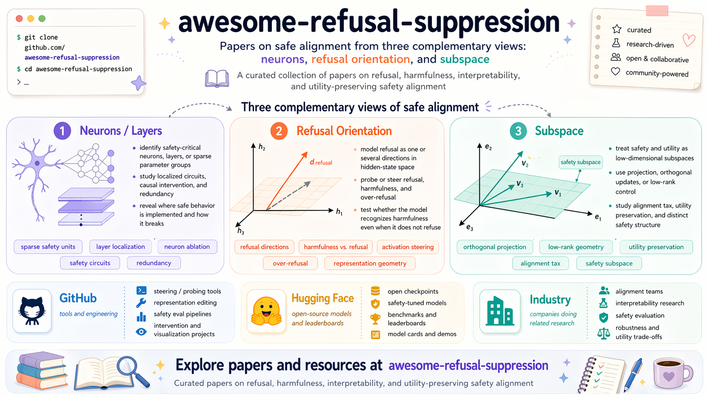

# Awesome Refusal Suppression

  <strong>English</strong> | <a href="./README.zh-CN.md">简体中文</a>

  
  
  
  
  
  

  

## 🎯 Task Introduction

Refusal suppression studies how to reduce or remove an aligned model's tendency to reject a target class of requests. In the most common setup, a model has learned a safety boundary during alignment, and the task asks whether that refusal behavior can be weakened, redirected, or made more selective while measuring both safety-break success and general capability retention.

This repository uses "refusal suppression" as a broad umbrella term covering removal of refusal directions, mitigation of over-refusal, boundary editing, safety-neuron or sparse-component intervention, and public dealignment-style model ecosystems. It does not treat generic jailbreak prompting as the central object; the focus is on model-side mechanisms, representations, updates, and public artifacts that change refusal behavior.

| Aspect | Definition in this repo | Typical evaluation question |
| --- | --- | --- |
| Target behavior | The model refuses, avoids, or gives safety-style non-answers for a class of prompts. | Does the method reduce refusal on the target prompts? |
| Intervention object | Activations, directions, neurons, low-rank updates, fine-tuning data, or released checkpoints. | What internal or parameter-level carrier of refusal is being changed? |
| Safety outcome | The model becomes more willing to answer prompts that were previously refused. | How much does ASR or refusal-rate change? |
| Capability constraint | The model should preserve benign reasoning, perception, and instruction-following ability. | How much capability is retained on non-safety benchmarks? |
| Boundary control | The method should ideally distinguish over-refusal from genuinely unsafe requests. | Does it reduce false refusals without indiscriminately weakening safeguards? |

---

> The fastest field guide to refusal suppression research: from safety neurons and refusal directions to subspaces, low-rank structure, and the public dealignment ecosystem.

<strong>Agent-assisted, human-curated, periodically refreshed.</strong>

> 🚧 Coming Soon: we are building a companion Project that consolidates implementation code across different backbones and baseline methods.

Welcome to `Awesome Refusal Suppression`.

This repository curates public papers, codebases, benchmarks, industry projects, and Hugging Face resources on refusal suppression. The current structure follows a reusable awesome-building framework: task introduction first, then benchmark summary, research directions, ecosystem panels, and contact.

- safety neurons and sparse safety components
- refusal directions and activation steering
- subspaces, low-rank structure, and over-refusal mitigation
- integrated GitHub tooling, public models, and public-facing labs / companies

Last updated: `2026-06-12`

---

## 🧭 Table of Contents

- [🎯 Task Introduction](#task-introduction)
- [🧪 Core Benchmarks](#core-benchmarks)
- [🗺️ Structured Landscape](#structured-landscape)
    - [🧠 Safety Neurons / Sparse Components](#safety-neurons)
    - [🧭 Refusal Directions / Activation Steering](#refusal-directions)
    - [🧩 Subspaces / Low-Rank Structure](#subspaces-low-rank)
- [🧱 Ecosystem Panels](#ecosystem-panels)
    - [💻 GitHub Tooling](#github-tooling)
    - [🤗 Popular Hugging Face Models](#hugging-face-models)
    - [🏆 Hugging Face Leaderboards / Spaces](#hugging-face-leaderboards)
- [📮 Contact](#contact)

## 🚀 Quick Start

- Read [Task Introduction](#task-introduction) first if you want the definition and goal of refusal suppression.
- Start with [Core Benchmarks](#core-benchmarks) if you are planning experiments or comparing methods.
- Read [Structured Landscape](#structured-landscape) first if you want the field map before reading papers.
- Jump to [Safety Neurons / Sparse Components](#safety-neurons) for mechanistic localization work.
- Jump to [Refusal Directions / Activation Steering](#refusal-directions) for activation-space control work.
- Jump to [Subspaces / Low-Rank Structure](#subspaces-low-rank) for geometry, low-rank editing, and over-refusal mitigation.
- Use [Ecosystem Panels](#ecosystem-panels) for public tooling, public checkpoints, and organization-level tracking.

## 🧪 Core Benchmarks

If you are entering this area from the experiment side, start here. This benchmark stack follows our current large-scale comparison setup and separates safety-break evaluation from capability retention. The `2026-06-12` monthly refresh did not require benchmark substitutions; all benchmark links below passed a link-availability check on `2026-06-12`, while the dataset descriptions still reflect the last full benchmark-page audit on `2026-04-17`. Recent over-refusal-specific benchmark papers such as OR-Bench and EVOREFUSE are tracked in [Structured Landscape](#structured-landscape) because this section is reserved for the current experiment stack.

### Safety benchmarks

| Benchmark | Modality | Dataset / official link | Checked dataset description | Metric | Characteristics |
| --- | --- | --- | --- | --- | --- |
| AdvBench | Text | [Official repo](https://github.com/llm-attacks/llm-attacks) / [HF dataset card](https://huggingface.co/datasets/walledai/AdvBench) | The official attack benchmark is distributed through the llm-attacks project; the public dataset card describes 500 harmful behaviors written as instructions for jailbreak evaluation. | ASR | Default text-side safety baseline. |
| StrongREJECT | Text | [Official repo](https://github.com/dsbowen/strong_reject) / [Official HF dataset](https://huggingface.co/datasets/AlignmentResearch/StrongREJECT) | The official benchmark repo describes prompts spanning 6 harmful-behavior categories, and the official HF dataset exposes the 313-prompt evaluation split. | ASR | More sensitive to refusal robustness than ordinary harmful prompts. |
| JailbreakV-28K | Vision-language | [Official HF dataset](https://huggingface.co/datasets/JailbreakV-28K/JailBreakV-28k) / [Paper](https://arxiv.org/abs/2404.03027) | The official dataset card describes 28,000 jailbreak text-image pairs: 20,000 text-transfer attacks plus 8,000 image-based attacks, covering 16 safety policies and 5 jailbreak methods. | ASR | Main multimodal safety benchmark. |
| vlsbench | Vision-language | [Official HF dataset](https://huggingface.co/datasets/Foreshhh/vlsbench) / [Official repo](https://github.com/hxhcreate/VLSBench) | The official repo presents VLSBench as a visually leakless multimodal safety benchmark with about 2.4k image-text pairs, designed to remove risk leakage from the text query. | ASR | Complementary multimodal safety benchmark. |

### Capability-retention benchmarks

| Benchmark | Dataset / official link | Checked dataset description | Metric | Characteristics |
| --- | --- | --- | --- | --- |
| MMStar | [Official HF dataset](https://huggingface.co/datasets/Lin-Chen/MMStar) / [Official repo](https://github.com/MMStar-Benchmark/MMStar) | The official repo describes MMStar as a vision-indispensable benchmark with 1,500 human-selected challenge samples, balanced across 6 core capabilities and 18 detailed axes. | ACC / Score | Overall capability snapshot. |
| MME-RealWorld | [Official HF dataset](https://huggingface.co/datasets/yifanzhang114/MME-RealWorld) / [Project page](https://mme-realworld.github.io/home_page.html) | The official project and dataset card describe 13,366 high-resolution images with 29,429 annotations across 43 tasks for practical real-world multimodal understanding. | ACC / Score | Retention of practical perception and grounding. |
| MathVista | [Official HF dataset](https://huggingface.co/datasets/AI4Math/MathVista) / [Project page](https://mathvista.github.io/) | The official dataset card describes MathVista as a visual mathematical reasoning benchmark with 6,141 examples drawn from 31 datasets, released with `testmini` and `test` splits. | ACC / Score | Retention of reasoning ability. |
| ColorBench | [Official HF dataset](https://huggingface.co/datasets/umd-zhou-lab/ColorBench) / [Official repo](https://github.com/tianyi-lab/ColorBench) | The official dataset card and repo describe 5,800+ image-text questions across 3 categories and 11 tasks for color perception, reasoning, and robustness. | ACC / Score | Retention of fine-grained perception. |

---

## 🗺️ Structured Landscape

The repository now uses one consistent structure: three research tracks plus one ecosystem module. Foundational safety-alignment and over-refusal benchmark papers are kept here as framing context instead of being treated as a separate long branch.

| Module | Focus | Main line of work | Typical methods |
| --- | --- | --- | --- |
| Foundations and boundary measurement | How the refusal boundary is taught and measured | Define harmlessness training, preference data, and over-refusal benchmarks that later suppression work reacts to. | Constitutional training, preference alignment, harmlessness data construction, benchmark suite design. |
| Safety neurons / sparse components | Refusal localization inside the model | Treat refusal as behavior carried by a small set of neurons, heads, layers, experts, routers, or safety modules. | Activation contrasting, causal patching, ablation, selective tuning, freezing, neuron transplant, expert masking, router intervention, sparse pruning. |
| Refusal directions / activation steering | Refusal control in activation space | Treat refusal as a direction or a small group of directions in activation space. | Contrastive activation addition, activation steering, conditional steering, affine editing, direction-based adversarial training. |
| Subspaces / low-rank structure | Multi-dimensional geometry of refusal | Extend the single-direction view into subspaces, concept cones, polytopes, and low-rank safety patches. | LoRA constraints, subspace projection, model fusion, SVD / SAE decomposition, null-space constraints, targeted representation tuning. |

### Foundational context papers

| Paper | Year | Venue / Status | Citations | Characteristics |
| --- | --- | --- | ---: | --- |
| [RefusalBench: Generative Evaluation of Selective Refusal in Grounded Language Models](https://aclanthology.org/2026.eacl-long.321/) | 2026 | EACL 2026 | N/A | Introduces generative evaluation for selective refusal in grounded / RAG-style settings, with released RefusalBench-NQ and RefusalBench-GaRAGe resources. Companion repo: [refusalbench](https://github.com/aashiqmuhamed/refusalbench). |
| [Blind Refusal: Language Models Refuse to Help Users Evade Unjust, Absurd, and Illegitimate Rules](https://arxiv.org/abs/2604.06233) | 2026 | arXiv 2026 | N/A | Introduces blind refusal as a boundary-measurement problem where models refuse defeated-rule requests even when the request has no independent safety or dual-use concern. |
| [Mitigating Over-Refusal in Aligned Large Language Models via Inference-Time Activation Energy](https://arxiv.org/abs/2510.08646) | 2025 | arXiv 2025, revised 2026 | N/A | Proposes Energy Landscape Steering as a tuning-free inference-time intervention for reducing false refusals while preserving safety behavior. |
| [EVOREFUSE: Evolutionary Prompt Optimization for Evaluation and Mitigation of LLM Over-Refusal to Pseudo-Malicious Instructions](https://arxiv.org/abs/2505.23473) | 2025 | NeurIPS 2025 | N/A | A recent benchmark-and-alignment paper built around evolved pseudo-malicious instructions for over-refusal analysis and mitigation. |
| [VSCBench: Bridging the Gap in Vision-Language Model Safety Calibration](https://aclanthology.org/2025.findings-acl.158/) | 2025 | Findings of ACL 2025 | N/A | A multimodal safety-calibration benchmark explicitly designed to measure both under-safety and over-safety in VLMs. |
| [Refuse without Refusal: A Structural Analysis of Safety-Tuning Responses for Reducing False Refusals in Language Models](https://openreview.net/forum?id=enpCeRYBhe) | 2025 | Submitted to ICLR 2026 | N/A | Shows that rationale-only safety supervision can reduce false refusals without keeping boilerplate refusal statements. |
| [OR-Bench: An Over-Refusal Benchmark for Large Language Models](https://arxiv.org/abs/2405.20947) | 2024 | ICML 2025 | N/A | The first large-scale over-refusal benchmark, with 80k over-refusal prompts plus hard and toxic splits. Related dataset: [HF](https://huggingface.co/datasets/bench-llm/or-bench). |
| [XSTest: A Test Suite for Identifying Exaggerated Safety Behaviours in Large Language Models](https://arxiv.org/abs/2308.01263) | 2023 | NAACL 2024 | 29 | Core benchmark for over-refusal and exaggerated safety behavior. |
| [BeaverTails: Towards Improved Safety Alignment of LLM via a Human-Preference Dataset](https://arxiv.org/abs/2307.04657) | 2023 | NeurIPS 2023 | 34 | One of the most common public entry points for safety preference data. Related dataset: [HF](https://huggingface.co/datasets/PKU-Alignment/BeaverTails). |
| [Constitutional AI: Harmlessness from AI Feedback](https://www.anthropic.com/research/constitutional-ai-harmlessness-from-ai-feedback) | 2022 | arXiv 2022 | N/A | Canonical harmlessness training pipeline built around constitutions, self-critique, and AI feedback. |

One-sentence summary of the field: early work suggested refusal behaves like a direction; newer work emphasizes sparse components, multi-direction geometry, and low-rank structure, while benchmark work keeps the safety-retention tradeoff measurable.

---

## 🧠 Safety Neurons / Sparse Components

This track assumes refusal is carried by a sparse set of neurons, heads, layers, experts, routers, or safety-critical modules rather than only by one global direction. The core workflow is to localize the internal carrier first, then intervene locally.

| Paper | Year | Venue / Status | Citations | Characteristics |
| --- | --- | --- | ---: | --- |
| [Expert-Aware Refusal Steering](https://arxiv.org/abs/2606.04160) | 2026 | arXiv 2026 | N/A | Extends refusal steering to MoE LLMs and shows expert-specific directions and routing patterns can suppress refusal behavior in expert-aware ways. |
| [A Single Neuron Is Sufficient to Bypass Safety Alignment in Large Language Models](https://arxiv.org/abs/2605.08513) | 2026 | arXiv 2026 | N/A | Identifies causally sufficient refusal neurons and shows single-neuron suppression can bypass safety alignment across harmful requests. |
| [How Alignment Routes: Localizing, Scaling, and Controlling Policy Circuits in Language Models](https://arxiv.org/abs/2604.04385) | 2026 | arXiv 2026 | N/A | Localizes a sparse gate-amplifier policy circuit for refusal behavior and shows that modulating the routing signal continuously changes policy strength. |
| [Deactivating Refusal Triggers: Understanding and Mitigating Overrefusal in Safety Alignment](https://arxiv.org/abs/2603.11388) | 2026 | arXiv 2026 | N/A | Studies refusal-trigger cues created by safety-alignment fine-tuning and proposes trigger-aware mitigation for over-refusal. |
| [Beyond I'm Sorry, I Can't: Dissecting Large-Language-Model Refusal](https://ojs.aaai.org/index.php/AAAI/article/view/41119) | 2026 | AAAI 2026 | N/A | Uses sparse autoencoders to find refusal-critical feature sets whose ablation flips models from refusal to compliance, exposing redundant causal features in refusal behavior. |
| [Sparse Models, Sparse Safety: Unsafe Routes in Mixture-of-Experts LLMs](https://arxiv.org/abs/2602.08621) | 2026 | arXiv 2026 | N/A | Extends sparse safety localization to MoE routers, identifying unsafe routes and router-level interventions. Companion code: [TrustAIRLab/UnsafeMoE](https://github.com/TrustAIRLab/UnsafeMoE). |
| [Towards Understanding Safety Alignment: A Mechanistic Perspective from Safety Neurons](https://openreview.net/forum?id=AAXMcAyNF6) | 2025 | NeurIPS 2025 Poster | 1 | Important for understanding the link between safety sparsity and capability coupling. |
| [SAFEx: Analyzing Vulnerabilities of MoE-Based LLMs via Stable Safety-critical Expert Identification](https://proceedings.neurips.cc/paper_files/paper/2025/hash/bd127877149d4965ad834c75a65b3052-Abstract-Conference.html) | 2025 | NeurIPS 2025 | N/A | Identifies safety-critical experts in MoE LLMs and decomposes them into harmful-content detection and harmful-response control groups. Companion code: [Bearisbug/SAFEx](https://github.com/Bearisbug/SAFEx). |
| [Safety Alignment Should Be Made More Than Just A Few Attention Heads](https://arxiv.org/abs/2508.19697) | 2025 | arXiv 2025 | N/A | Citation-expansion hit from refusal-direction work; uses refusal-direction-guided attention-head ablation and argues safety behavior should be distributed across more heads. |
| [Understanding and Enhancing Safety Mechanisms of LLMs via Safety-Specific Neuron](https://openreview.net/forum?id=yR47RmND1m) | 2025 | ICLR 2025 | N/A | A representative safety-neuron paper emphasizing sparse internal carriers of refusal. Companion code: [Safety-Neuron](https://github.com/zhaoyiran924/Safety-Neuron). |

---

## 🧭 Refusal Directions / Activation Steering

This track treats refusal as an activation-space control problem. The main pattern is to identify refusal directions or activation features, then weaken, strengthen, or conditionally gate them at inference time or during training.

| Paper | Year | Venue / Status | Citations | Characteristics |
| --- | --- | --- | ---: | --- |
| [Latent-space Attacks for Refusal Evasion in Language Models](https://arxiv.org/abs/2605.21706) | 2026 | arXiv 2026 | N/A | Recasts refusal-direction ablation as latent-space evasion against refusal probes and pushes representations into the compliant region rather than stopping at the boundary. |
| [Steering Safely or Off a Cliff? Rethinking Specificity and Robustness in Inference-Time Interventions](https://aclanthology.org/2026.eacl-long.268/) | 2026 | EACL 2026 | N/A | Evaluates whether steering changes only the intended property; over-refusal steering can preserve ordinary capability while increasing safety-break vulnerability, so robustness specificity must be checked. |
| [There Is More to Refusal in Large Language Models than a Single Direction](https://arxiv.org/abs/2602.02132) | 2026 | arXiv 2026 | N/A | Directly challenges the single-direction account by separating multiple refusal and non-compliance directions, while showing many directions still behave like a shared control knob. |
| [RepIt: Steering Language Models with Concept-Specific Refusal Vectors](https://openreview.net/forum?id=fsZkx8gek0) | 2026 | ICLR 2026 Poster | N/A | Moves from one global refusal vector toward concept-specific refusal vectors and shows selective refusal suppression can evade standard safety benchmarks. |
| [AlphaSteer: Learning Refusal Steering with Principled Null-Space Constraint](https://openreview.net/forum?id=1vvbzAqdTe) | 2026 | ICLR 2026 Poster | N/A | A null-space-constrained refusal-steering method that explicitly targets the safety, utility, and over-refusal tradeoff. |
| [Differentiated Directional Intervention: A Framework for Evading LLM Safety Alignment](https://ojs.aaai.org/index.php/AAAI/article/view/41148) | 2026 | AAAI 2026 | N/A | Splits the single refusal direction into harm-detection and refusal-execution directions, then applies differentiated bidirectional intervention to evade safety alignment. |
| [SOM Directions are Better than One: Multi-Directional Refusal Suppression in Language Models](https://ojs.aaai.org/index.php/AAAI/article/view/40551) | 2026 | AAAI 2026 | 0 | A recent flagship paper showing that multiple refusal directions outperform a single-vector view. Companion code: [som-refusal-directions](https://github.com/pralab/som-refusal-directions). |
| [Refusal Direction is Universal Across Safety-Aligned Languages](https://openreview.net/forum?id=eWxKpdAdXH) | 2025 | NeurIPS 2025 Poster | N/A | Shows refusal directions transfer across 14 languages and that English-derived refusal suppression can generalize cross-lingually. Companion repo: [Multilingual-Refusal](https://github.com/mainlp/Multilingual-Refusal). |
| [LLMs Encode Harmfulness and Refusal Separately](https://papers.neurips.cc/paper_files/paper/2025/hash/cd18539787d90e1d682d557c2c71b534-Abstract-Conference.html) | 2025 | NeurIPS 2025 | N/A | Separates harmfulness and refusal representations, supporting selective steering and latent-guard analysis rather than treating refusal as the only safety signal. Companion code: [LLMs_Encode_Harmfulness_Refusal_Separately](https://github.com/CHATS-lab/LLMs_Encode_Harmfulness_Refusal_Separately). |
| [COSMIC: Generalized Refusal Direction Identification in LLM Activations](https://aclanthology.org/2025.findings-acl.1310/) | 2025 | Findings of ACL 2025 | N/A | Automatically identifies refusal steering directions and target layers using cosine similarity, without relying on refusal templates or output-token assumptions. Companion code: [COSMIC](https://github.com/wang-research-lab/COSMIC). |
| [The Geometry of Refusal in Large Language Models: Concept Cones and Representational Independence](https://openreview.net/forum?id=80IwJqlXs8) | 2025 | ICML 2025 Poster | 0 | Expands the picture from one direction to multi-direction geometry. |
| [Surgical, Cheap, and Flexible: Mitigating False Refusal in Language Models via Single Vector Ablation](https://openreview.net/forum?id=SCBn8MCLwc) | 2024 | ICLR 2025 | N/A | A lightweight training-free method that mitigates false refusals by ablating an orthogonalized false-refusal vector. Companion code: [False-Refusal-Mitigation](https://github.com/mainlp/False-Refusal-Mitigation). |
| [Refusal in LLMs is an Affine Function](https://arxiv.org/abs/2411.09003) | 2024 | arXiv 2024 | N/A | Extends directional refusal control into affine concept editing and shows stronger control than simple direction-only interventions. Companion code: [steering-llama3](https://github.com/EleutherAI/steering-llama3). |
| [Programming Refusal with Conditional Activation Steering](https://research.ibm.com/publications/programming-refusal-with-conditional-activation-steering) | 2024 | ICLR 2025 | 0 | Refusal as conditional, programmable activation steering. Companion repo: [IBM/activation-steering](https://github.com/IBM/activation-steering). |
| [Refusal in Language Models Is Mediated by a Single Direction](https://arxiv.org/abs/2406.11717) | 2024 | arXiv 2024 | 11 | The signature single-direction refusal paper. Companion code: [refusal_direction](https://github.com/andyrdt/refusal_direction). |
| [Steering Llama 2 via Contrastive Activation Addition](https://aclanthology.org/2024.acl-long.828/) | 2023 | ACL 2024 | 18 | Upstream activation-steering reference for many refusal-control papers. |

---

## 🧩 Subspaces / Low-Rank Structure

This track studies why safety can be broken by low-rank updates, and how to move the representation only enough to reduce over-refusal without relaxing genuinely dangerous cases. It is where geometry, parameter-efficient editing, and safety-retention tradeoffs meet.

| Paper | Year | Venue / Status | Citations | Characteristics |
| --- | --- | --- | ---: | --- |
| [RefusalGuard: Geometry-Preserving Fine-Tuning for Safety in LLMs](https://arxiv.org/abs/2605.01913) | 2026 | arXiv 2026 | N/A | Recent citation-expansion candidate on preserving refusal geometry during fine-tuning; useful as the safety-preservation counterpart to refusal-suppression editing. |
| [Over-Refusal and Representation Subspaces: A Mechanistic Analysis of Task-Conditioned Refusal in Aligned LLMs](https://arxiv.org/abs/2603.27518) | 2026 | arXiv 2026 | N/A | Separates harmful-refusal geometry from over-refusal geometry and argues that one global refusal-vector ablation is insufficient for over-refusal mitigation. |
| [Can LLM Safety Be Ensured by Constraining Parameter Regions?](https://arxiv.org/abs/2602.17696) | 2026 | arXiv 2026 | N/A | Evaluates whether stable parameter-level safety regions exist across datasets, granularities, and model families; relevant to low-rank and parameter-region safety editing. |
| [Safety Subspaces are Not Linearly Distinct: A Fine-Tuning Case Study](https://openreview.net/forum?id=Fj6LakRHcT) | 2026 | ICLR 2026 Poster | N/A | A high-signal negative result showing that cleanly separable safety subspaces can break down after fine-tuning. |
| [SafeConstellations: Mitigating Over-Refusals in LLMs Through Task-Aware Representation Steering](https://openreview.net/forum?id=oImCOjXEiS) | 2026 | ACL ARR 2026 January Submission | N/A | Tracks task-specific representation regions and steers them at inference time to reduce over-refusal with limited utility loss. |
| [Just Enough Shifts: Mitigating Over-Refusal in Aligned Language Models with Targeted Representation Fine-Tuning](https://proceedings.mlr.press/v267/dabas25a.html) | 2025 | ICML 2025 | 1 | A clean over-refusal mitigation paper very close to the refusal-suppression boundary-editing story. |
| [Assessing the Brittleness of Safety Alignment via Pruning and Low-Rank Modifications](https://proceedings.mlr.press/v235/wei24f.html) | 2024 | ICML 2024 | 2 | Strong evidence that safety can be brittle under small parameter or rank changes. |

Legacy citation counts are a `2026-04-15` snapshot. Newly added rows use `N/A` when exact-title disambiguation was not stable enough to trust.

---

## 🧱 Ecosystem Panels

This section tracks public tooling, model checkpoints, leaderboard-style Spaces, and organization-level signals. Paper-companion repos and paper-companion checkpoints are intentionally merged back into the paper sections rather than repeated here.

### 💻 GitHub Tooling

GitHub stars checked on `2026-06-12`. Large repositories are displayed in rounded `k` format for readability; exact counts are preserved in the review bundle source log when available.

| Project | Stars | Link | Characteristics |
| --- | ---: | --- | --- |
| Heretic | 24.2k | [p-e-w/heretic](https://github.com/p-e-w/heretic) | The most visible refusal-suppression repository right now. |
| garak | 8.1k | [NVIDIA/garak](https://github.com/NVIDIA/garak) | High-visibility LLM security scanner and red-teaming toolkit. |
| OBLITERATUS | 6.4k | [elder-plinius/OBLITERATUS](https://github.com/elder-plinius/OBLITERATUS) | High-traction abliteration / refusal-removal engineering project that is not just a paper companion repo. |
| llm-guard | 3.1k | [protectai/llm-guard](https://github.com/protectai/llm-guard) | Application-layer guardrails counterpart to model-internal safety editing. |
| representation-engineering | 1.0k | [andyzoujm/representation-engineering](https://github.com/andyzoujm/representation-engineering) | A useful general toolkit for activation-space interventions. |
| HarmBench | 981 | [centerforaisafety/HarmBench](https://github.com/centerforaisafety/HarmBench) | One of the most common public safety evaluation benchmarks. |
| abliterix | 148 | [wuwangzhang1216/abliterix](https://github.com/wuwangzhang1216/abliterix) | Automated alignment-adjustment toolkit covering steering, LoRA-style editing, MoE expert-level controls, and Optuna search. |
| steering-vectors | 151 | [steering-vectors/steering-vectors](https://github.com/steering-vectors/steering-vectors) | A reusable steering library with docs and examples for representation-engineering workflows. |

### 🤗 Popular Hugging Face Models

Hugging Face metrics checked on `2026-06-12`. Figures come from public Hugging Face model pages or the Hugging Face API; downloads are rolling public snapshots and may decrease across refreshes when the platform changes the visible time window. This table prioritizes high-traction public checkpoints and a small number of flagship ecosystem weights.

| Repo | Likes | Downloads | Link | Notes |
| --- | ---: | ---: | --- | --- |
| perplexity-ai/r1-1776 | 2.32k | 553 | [HF](https://huggingface.co/perplexity-ai/r1-1776) | Official anti-censorship model with very strong public visibility. |
| p-e-w/gpt-oss-20b-heretic | 123 | 834 | [HF](https://huggingface.co/p-e-w/gpt-oss-20b-heretic) | One of the most central public Heretic weights, now built on OpenAI's `gpt-oss-20b`. |
| Andycurrent/Gemma-3-1B-it-GLM-4.7-Flash-Heretic-Uncensored-Thinking_GGUF | 55 | 2,433,843 | [HF](https://huggingface.co/Andycurrent/Gemma-3-1B-it-GLM-4.7-Flash-Heretic-Uncensored-Thinking_GGUF) | High-download Heretic / uncensored GGUF derivative added in the `2026-06-12` refresh. |
| OBLITERATUS/gemma-4-E4B-it-OBLITERATED | 701 | 399,527 | [HF](https://huggingface.co/OBLITERATUS/gemma-4-E4B-it-OBLITERATED) | High-traction OBLITERATUS release with `refusal-removal`, `abliterated`, and `uncensored` tags. |
| mlabonne/Qwen3-30B-A3B-abliterated | 37 | 385,916 | [HF](https://huggingface.co/mlabonne/Qwen3-30B-A3B-abliterated) | High-download abliterated Qwen checkpoint added in the `2026-06-12` refresh. |
| mlabonne/gemma-3-27b-it-abliterated | 330 | 7,973 | [HF](https://huggingface.co/mlabonne/gemma-3-27b-it-abliterated) | Established abliterated Gemma lineage. |
| Orenguteng/Llama-3.1-8B-Lexi-Uncensored-V2 | 303 | 27,923 | [HF](https://huggingface.co/Orenguteng/Llama-3.1-8B-Lexi-Uncensored-V2) | A representative uncensored Llama-family community model. |
| huihui-ai/DeepSeek-R1-Distill-Qwen-32B-abliterated | 244 | 45,631 | [HF](https://huggingface.co/huihui-ai/DeepSeek-R1-Distill-Qwen-32B-abliterated) | One of the higher-visibility abliterated checkpoints. |
| paperscarecrow/Gemma-4-31B-it-abliterated | 106 | 117,674 | [HF](https://huggingface.co/paperscarecrow/Gemma-4-31B-it-abliterated) | A high-download community abliterated model. |
| HauhauCS/Gemma-4-E4B-Uncensored-HauhauCS-Aggressive | 774 | 619,943 | [HF](https://huggingface.co/HauhauCS/Gemma-4-E4B-Uncensored-HauhauCS-Aggressive) | Massive community traction. |
| nohurry/gemma-4-26B-A4B-it-heretic-GUFF | 70 | 7,913 | [HF](https://huggingface.co/nohurry/gemma-4-26B-A4B-it-heretic-GUFF) | Heretic derivative retained as a lineage signal. |
| llmfan46/gemma-4-31B-it-uncensored-heretic-GGUF | 113 | 109,406 | [HF](https://huggingface.co/llmfan46/gemma-4-31B-it-uncensored-heretic-GGUF) | Heretic derivative amplified through GGUF distribution. |
| Jiunsong/supergemma4-26b-uncensored-gguf-v2 | 808 | 142,580 | [HF](https://huggingface.co/Jiunsong/supergemma4-26b-uncensored-gguf-v2) | Mid-sized but stable uncensored community resource. |
| DavidAU/Qwen3.5-40B-Claude-4.6-Opus-Deckard-Heretic-Uncensored-Thinking | 201 | 1,167 | [HF](https://huggingface.co/DavidAU/Qwen3.5-40B-Claude-4.6-Opus-Deckard-Heretic-Uncensored-Thinking) | Community-style derivative with nontrivial traction. |
| HauhauCS/Qwen3.5-35B-A3B-Uncensored-HauhauCS-Aggressive | 1.42k | 205,270 | [HF](https://huggingface.co/HauhauCS/Qwen3.5-35B-A3B-Uncensored-HauhauCS-Aggressive) | Huge community demand signal. |
| HauhauCS/Qwen3.5-9B-Uncensored-HauhauCS-Aggressive | 1.53k | 554,514 | [HF](https://huggingface.co/HauhauCS/Qwen3.5-9B-Uncensored-HauhauCS-Aggressive) | Smaller sibling with equally striking download volume. |
| HauhauCS/Qwen3.6-35B-A3B-Uncensored-HauhauCS-Aggressive | 1.69k | 3,057,541 | [HF](https://huggingface.co/HauhauCS/Qwen3.6-35B-A3B-Uncensored-HauhauCS-Aggressive) | A highly visible successor in the same high-traction uncensored Qwen family. |

### 🏆 Hugging Face Leaderboards / Spaces

Metrics checked on `2026-06-12`. This subsection tracks public Spaces or leaderboard-style resources that measure refusal-suppression-adjacent model behavior.

| Resource | Status | Link | Characteristics |
| --- | --- | --- | --- |
| OBLITERATUS Space | Running; 377 likes | [HF Space](https://huggingface.co/spaces/pliny-the-prompter/obliteratus) | Official Space paired with OBLITERATUS; useful ecosystem signal for abliteration and refusal-removal tooling. |
| UGI-Leaderboard | Running; about 1.82k likes | [HF Space](https://huggingface.co/spaces/DontPlanToEnd/UGI-Leaderboard) | Public "Uncensored General Intelligence Leaderboard" Space; useful for tracking community evaluation signals around uncensored and refusal-suppression-adjacent models. |

### 🏢 Public Labs / Companies

This panel tracks organization-level public positioning and public-facing research directions. Detailed paper, repo, and model links are kept in the paper or Hugging Face sections to avoid duplication.

| Org | Public focus | Characteristics | Entry point |
| --- | --- | --- | --- |
| Anthropic | Harmlessness, system cards, and Constitutional AI | The system-card hub is now the clearest official entry point for recent harmlessness and safety-boundary reporting. | [System Cards](https://www.anthropic.com/system-cards) |
| OpenAI | Deliberative Alignment and Instruction Hierarchy Challenge | Public examples of explicit safety-boundary control through reasoning, hierarchy training, safety steerability, and over-refusal-aware instruction-conflict evaluation. | [Deliberative Alignment](https://openai.com/index/deliberative-alignment/) / [IH-Challenge](https://openai.com/index/instruction-hierarchy-challenge/) |
| Meta | Llama Guard and safety tooling | Important open-weight safety stack for the Llama ecosystem. | [Meta Llama 3](https://ai.meta.com/blog/meta-llama-3/) |
| IBM Research | AI steerability and mechanistic refusal control | One of the clearest enterprise steering stories around refusal, now paired with an official public steerability toolkit launch. | [AI Steerability 360](https://research.ibm.com/blog/lightweight-AI-steering-tools) |
| Perplexity | Anti-censorship model positioning | Public anti-censorship positioning with strong community visibility. | [Blog](https://www.perplexity.ai/hub/blog/open-sourcing-r1-1776) |
| Venice | Venice Unfiltered | Startup-side uncensored-AI positioning with clear public visibility. | [Official](https://venice.ai/blog/introducing-venice-unfiltered-our-open-source-uncensored-model) |

---

## 📮 Contact

For questions or collaborations, please contact:

- Yan Hong: `ruoning.hy@antgroup.com`
- Kedong Xiu: `kedongxiu@zju.edu.cn`
- Jun Lan: `yelan.lj@antgroup.com`
