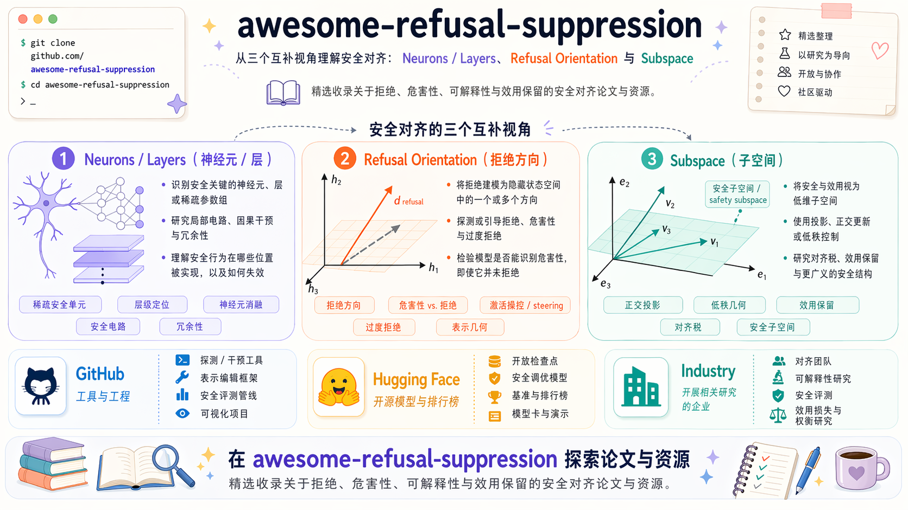

# Awesome Refusal Suppression

  <a href="./README.md">English</a> | <strong>简体中文</strong>

  
  
  
  
  
  

  

## 🎯 任务介绍

去拒答研究的是如何降低或移除对齐模型对某一类请求的拒答倾向。最常见的设定是：模型在安全对齐过程中学到了某种安全边界，而去拒答任务关注能否削弱、重定向或更精细地控制这种拒答行为，同时评估安全突破效果和通用能力保留情况。

本仓库把“去拒答 / refusal suppression”作为一个相对宽的统称，覆盖拒答方向移除、过度拒答缓解、安全边界编辑、安全神经元或稀疏组件干预，以及公开的去安全对齐模型生态。这里不把通用 jailbreak prompt 本身作为核心对象，而是更关注会改变拒答行为的模型侧机制、表征、参数更新和公开模型产物。

| 维度 | 本仓库中的定义 | 典型评测问题 |
| --- | --- | --- |
| 目标行为 | 模型对某类 prompt 拒绝回答、回避回答，或输出安全模板式非答案。 | 方法是否降低了目标 prompt 上的拒答率？ |
| 干预对象 | 激活、方向、神经元、低秩更新、微调数据或公开 checkpoint。 | 被修改的拒答承载机制是什么？ |
| 安全结果 | 模型更愿意回答原本会被拒绝的请求。 | ASR 或 refusal-rate 变化有多大？ |
| 能力约束 | 模型应尽量保留正常推理、感知和指令跟随能力。 | 非安全 benchmark 上的能力保留情况如何？ |
| 边界控制 | 理想方法应区分过度拒答和真正危险请求。 | 能否减少误拒答，而不是无差别削弱安全防护？ |

---

> 一份快速理解拒答抑制研究版图的导航：从安全神经元、拒答方向，到子空间、低秩结构，以及公开的去安全对齐生态。

<strong>Agent 辅助更新，人工筛选把关，定期持续刷新。</strong>

> 🚧 即将推出：我们正在建设一个配套 Project，统一整理不同基座在不同 baseline 方案上的实现代码。

欢迎来到 `Awesome Refusal Suppression`。

这个仓库整理了拒答抑制相关的公开论文、代码仓库、评测资源、产业项目和 Hugging Face 资源。当前结构采用一套可复用的 awesome 搭建框架：先给任务介绍，再给 benchmark 总结、调研研究方向、生态面板和联系方式。

- 安全神经元与稀疏安全组件
- 拒答方向与表征引导
- 子空间、低秩结构与过度拒答缓解
- 整合型 GitHub 工具、公开模型与机构生态

最后更新：`2026-06-12`

---

## 🧭 目录

- [🎯 任务介绍](#task-introduction)
- [🧪 核心基准评测](#core-benchmarks)
- [🗺️ 结构化研究版图](#structured-landscape)
    - [🧠 安全神经元 / 稀疏组件](#safety-neurons)
    - [🧭 拒答方向 / 表征引导](#refusal-directions)
    - [🧩 子空间 / 低秩结构](#subspaces-low-rank)
- [🧱 生态面板](#ecosystem-panels)
    - [💻 GitHub 工具与工程](#github-tooling)
    - [🤗 Hugging Face 热门模型](#hugging-face-models)
    - [🏆 Hugging Face 榜单 / Spaces](#hugging-face-leaderboards)
- [📮 联系我们](#contact)

## 🚀 快速开始

- 如果你想先理解去拒答任务的定义和目标，请看 [任务介绍](#task-introduction)。
- 如果你是从实验设计、方法对比或结果复现进入这个方向，建议先看 [核心基准评测](#core-benchmarks)。
- 如果你想先看清整个领域的结构，再去读论文，建议先看 [结构化研究版图](#structured-landscape)。
- 如果你关注机制定位路线，请直接跳到 [安全神经元 / 稀疏组件](#safety-neurons)。
- 如果你关注激活空间控制，请直接跳到 [拒答方向 / 表征引导](#refusal-directions)。
- 如果你关注几何结构、低秩编辑和过度拒答问题，请看 [子空间 / 低秩结构](#subspaces-low-rank)。
- 如果你想快速看公开工具、公开 checkpoint 和机构动向，请看 [生态面板](#ecosystem-panels)。

## 🧪 核心基准评测

如果你是从实验视角进入这个方向，建议先看这里。当前这一组基准对齐我们的大规模实验记录方式，把安全突破效果和通用能力保留分开记录。`2026-06-12` 这一轮月度维护没有替换实验基准栈；下面所有 benchmark 链接已经在 `2026-06-12` 做过可访问性检查，数据集介绍仍然对应上一次完整 benchmark 页面核对，即 `2026-04-17`。像 OR-Bench 和 EVOREFUSE 这类更偏 over-refusal 的新 benchmark 论文，会放到 [结构化研究版图](#structured-landscape) 里统一跟踪，因为这里保留的是当前实验主栈。

### 安全评测基准

| Benchmark | 模态 | 数据 / 官方链接 | 核对后的数据集介绍 | 指标 | 特性 |
| --- | --- | --- | --- | --- | --- |
| AdvBench | 文本 | [官方仓库](https://github.com/llm-attacks/llm-attacks) / [HF 数据卡](https://huggingface.co/datasets/walledai/AdvBench) | 官方攻击基准由 llm-attacks 项目发布；公开数据卡将其描述为 500 条以指令形式组织的 harmful behaviors，用于 jailbreak 评测。 | ASR | 文本安全对比的默认基线。 |
| StrongREJECT | 文本 | [官方仓库](https://github.com/dsbowen/strong_reject) / [官方 HF 数据集](https://huggingface.co/datasets/AlignmentResearch/StrongREJECT) | 官方 benchmark 仓库说明它覆盖 6 类 harmful behavior；官方 HF 数据集给出了 313 条 prompt 的主评测划分。 | ASR | 对拒答鲁棒性更敏感。 |
| JailbreakV-28K | 图文 | [官方 HF 数据集](https://huggingface.co/datasets/JailbreakV-28K/JailBreakV-28k) / [论文](https://arxiv.org/abs/2404.03027) | 官方数据卡说明它包含 28,000 组 jailbreak 图文对，其中 20,000 条来自文本迁移攻击、8,000 条来自图像攻击，覆盖 16 类安全策略和 5 类 jailbreak 方法。 | ASR | 多模态主安全基准。 |
| vlsbench | 图文 | [官方 HF 数据集](https://huggingface.co/datasets/Foreshhh/vlsbench) / [官方仓库](https://github.com/hxhcreate/VLSBench) | 官方仓库将 VLSBench 描述为去除 visual safety leakage 的多模态安全 benchmark，规模约 2.4k 图文对，目标是避免文本直接泄露风险信息。 | ASR | 多模态补充安全基准。 |

### 通用能力保留基准

| Benchmark | 数据 / 官方链接 | 核对后的数据集介绍 | 指标 | 特性 |
| --- | --- | --- | --- | --- |
| MMStar | [官方 HF 数据集](https://huggingface.co/datasets/Lin-Chen/MMStar) / [官方仓库](https://github.com/MMStar-Benchmark/MMStar) | 官方仓库将 MMStar 描述为一个 vision-indispensable benchmark，包含 1,500 条人工筛选的高质量 challenge samples，覆盖 6 个核心能力和 18 个细粒度维度。 | ACC / Score | 通用能力总览。 |
| MME-RealWorld | [官方 HF 数据集](https://huggingface.co/datasets/yifanzhang114/MME-RealWorld) / [项目页](https://mme-realworld.github.io/home_page.html) | 官方项目页和数据卡说明它包含 13,366 张高分辨率图像、29,429 条标注、43 个任务，面向真实世界多模态理解。 | ACC / Score | 现实场景感知与 grounding 保留。 |
| MathVista | [官方 HF 数据集](https://huggingface.co/datasets/AI4Math/MathVista) / [项目页](https://mathvista.github.io/) | 官方数据卡将 MathVista 描述为视觉数学推理 benchmark，包含来自 31 个数据源的 6,141 个样本，并分为 `testmini` 和 `test`。 | ACC / Score | 推理能力保留。 |
| ColorBench | [官方 HF 数据集](https://huggingface.co/datasets/umd-zhou-lab/ColorBench) / [官方仓库](https://github.com/tianyi-lab/ColorBench) | 官方数据卡和仓库说明它包含 5,800+ 条图文问题，覆盖 3 大类、11 个任务，用于评估颜色感知、颜色推理和颜色鲁棒性。 | ACC / Score | 细粒度感知能力保留。 |

---

## 🗺️ 结构化研究版图

现在整个仓库统一采用一套结构：三条研究主线，加一个生态模块。基础性的安全对齐与过度拒答评测论文放在这里作为背景框架，不再单独拉出一条冗长分支。

| 模块 | 焦点 | 主要研究路线 | 常用方式 |
| --- | --- | --- | --- |
| 基础边界与评测 | 安全边界如何被教给模型，以及如何测量 | 定义无害性训练、偏好数据和过度拒答 benchmark，作为后续拒答抑制工作的参照系。 | Constitutional training、偏好对齐、无害性数据构造、benchmark 设计。 |
| 安全神经元 / 稀疏组件 | 模型内部的拒答定位 | 将拒答看成由少量神经元、注意力头、层、专家、router 或安全模块承载的行为。 | 激活对比、因果修补、消融、选择性微调、冻结、神经元移植、专家 masking、router 干预、稀疏剪枝。 |
| 拒答方向 / 表征引导 | 激活空间中的拒答控制 | 将拒答看成激活空间中的方向或少量方向组合。 | 对比激活加法、表征引导、条件化表征引导、仿射编辑、方向级对抗训练。 |
| 子空间 / 低秩结构 | 拒答的多维几何结构 | 将单方向视角扩展到子空间、概念锥、多面体和低秩安全补丁。 | LoRA 约束、子空间投影、模型融合、SVD / SAE 分解、零空间约束、目标表征微调。 |

### 基础背景论文

| 论文 | 年份 | 会议 / 状态 | 当前引用量 | 特性 |
| --- | --- | --- | ---: | --- |
| [RefusalBench: Generative Evaluation of Selective Refusal in Grounded Language Models](https://aclanthology.org/2026.eacl-long.321/) | 2026 | EACL 2026 | N/A | 面向 grounded / RAG 场景提出选择性拒答的生成式评测，并释放 RefusalBench-NQ 与 RefusalBench-GaRAGe 资源。配套仓库：[refusalbench](https://github.com/aashiqmuhamed/refusalbench)。 |
| [Blind Refusal: Language Models Refuse to Help Users Evade Unjust, Absurd, and Illegitimate Rules](https://arxiv.org/abs/2604.06233) | 2026 | arXiv 2026 | N/A | 将 blind refusal 作为安全边界测量问题：模型会拒绝帮助用户规避已经失去正当性的规则，即使请求本身没有独立安全或双用途风险。 |
| [Mitigating Over-Refusal in Aligned Large Language Models via Inference-Time Activation Energy](https://arxiv.org/abs/2510.08646) | 2025 | arXiv 2025，2026 修订 | N/A | 提出 Energy Landscape Steering，一种无需训练的推理期干预，用来降低误拒答并尽量保留安全行为。 |
| [EVOREFUSE: Evolutionary Prompt Optimization for Evaluation and Mitigation of LLM Over-Refusal to Pseudo-Malicious Instructions](https://arxiv.org/abs/2505.23473) | 2025 | NeurIPS 2025 | N/A | 近期较有代表性的过度拒答 benchmark 与对齐数据工作，围绕演化生成的伪恶意指令展开。 |
| [VSCBench: Bridging the Gap in Vision-Language Model Safety Calibration](https://aclanthology.org/2025.findings-acl.158/) | 2025 | Findings of ACL 2025 | N/A | 面向视觉语言模型安全校准的 benchmark，明确同时测量 under-safety 和 over-safety。 |
| [Refuse without Refusal: A Structural Analysis of Safety-Tuning Responses for Reducing False Refusals in Language Models](https://openreview.net/forum?id=enpCeRYBhe) | 2025 | ICLR 2026 投稿中 | N/A | 说明只保留拒答理由、去掉模板化拒答语句，可以有效减少误拒答。 |
| [OR-Bench: An Over-Refusal Benchmark for Large Language Models](https://arxiv.org/abs/2405.20947) | 2024 | ICML 2025 | N/A | 首个大规模过度拒答 benchmark，包含 80k 条表面有毒提示词，以及困难子集和有毒子集。相关数据集见 [HF](https://huggingface.co/datasets/bench-llm/or-bench)。 |
| [XSTest: A Test Suite for Identifying Exaggerated Safety Behaviours in Large Language Models](https://arxiv.org/abs/2308.01263) | 2023 | NAACL 2024 | 29 | 过度拒答和过度保守行为的核心评测资源。 |
| [BeaverTails: Towards Improved Safety Alignment of LLM via a Human-Preference Dataset](https://arxiv.org/abs/2307.04657) | 2023 | NeurIPS 2023 | 34 | 公开安全偏好数据的代表性入口之一。相关数据集见 [HF](https://huggingface.co/datasets/PKU-Alignment/BeaverTails)。 |
| [Constitutional AI: Harmlessness from AI Feedback](https://www.anthropic.com/research/constitutional-ai-harmlessness-from-ai-feedback) | 2022 | arXiv 2022 | N/A | 经典无害性训练路径，围绕原则、模型自我批评和 AI 反馈展开。 |

一句话概括这个领域的主线：早期工作倾向于把拒答看成一个方向，而更新的研究更强调拒答由稀疏组件、多方向几何和低秩结构共同作用，同时 benchmark 工作负责把安全与能力之间的权衡持续量化。

---

## 🧠 安全神经元 / 稀疏组件

这一条主线认为拒答可能主要由稀疏神经元、注意力头、层、专家、router 或安全关键模块承载，而不只是一个全局方向。核心工作流通常是先定位内部承载组件，再做局部干预。

| 论文 | 年份 | 会议 / 状态 | 当前引用量 | 特性 |
| --- | --- | --- | ---: | --- |
| [Expert-Aware Refusal Steering](https://arxiv.org/abs/2606.04160) | 2026 | arXiv 2026 | N/A | 将 refusal steering 扩展到 MoE LLM，并说明 expert-specific directions 与 routing patterns 可以以专家感知方式抑制拒答行为。 |
| [A Single Neuron Is Sufficient to Bypass Safety Alignment in Large Language Models](https://arxiv.org/abs/2605.08513) | 2026 | arXiv 2026 | N/A | 定位因果充分的拒答神经元，并展示抑制单个神经元就可能绕过有害请求上的安全对齐。 |
| [How Alignment Routes: Localizing, Scaling, and Controlling Policy Circuits in Language Models](https://arxiv.org/abs/2604.04385) | 2026 | arXiv 2026 | N/A | 定位拒答行为中的稀疏 gate-amplifier policy circuit，并展示调节 routing 信号可以连续控制策略强度。 |
| [Deactivating Refusal Triggers: Understanding and Mitigating Overrefusal in Safety Alignment](https://arxiv.org/abs/2603.11388) | 2026 | arXiv 2026 | N/A | 分析安全对齐微调产生的 refusal-trigger 线索，并提出面向触发词的过度拒答缓解方法。 |
| [Beyond I'm Sorry, I Can't: Dissecting Large-Language-Model Refusal](https://ojs.aaai.org/index.php/AAAI/article/view/41119) | 2026 | AAAI 2026 | N/A | 使用稀疏自编码器寻找 refusal-critical feature sets；消融这些特征可以把模型从拒答翻转为服从，并暴露拒答行为中的冗余因果特征。 |
| [Sparse Models, Sparse Safety: Unsafe Routes in Mixture-of-Experts LLMs](https://arxiv.org/abs/2602.08621) | 2026 | arXiv 2026 | N/A | 将稀疏安全定位扩展到 MoE router，识别 unsafe routes 与 router 级干预。配套代码：[TrustAIRLab/UnsafeMoE](https://github.com/TrustAIRLab/UnsafeMoE)。 |
| [Towards Understanding Safety Alignment: A Mechanistic Perspective from Safety Neurons](https://openreview.net/forum?id=AAXMcAyNF6) | 2025 | NeurIPS 2025 Poster | 1 | 对理解安全稀疏性与能力耦合关系很关键。 |
| [SAFEx: Analyzing Vulnerabilities of MoE-Based LLMs via Stable Safety-critical Expert Identification](https://proceedings.neurips.cc/paper_files/paper/2025/hash/bd127877149d4965ad834c75a65b3052-Abstract-Conference.html) | 2025 | NeurIPS 2025 | N/A | 识别 MoE LLM 中的安全关键专家，并将其分解为有害内容检测组和有害响应控制组。配套代码：[Bearisbug/SAFEx](https://github.com/Bearisbug/SAFEx)。 |
| [Safety Alignment Should Be Made More Than Just A Few Attention Heads](https://arxiv.org/abs/2508.19697) | 2025 | arXiv 2025 | N/A | 从拒答方向论文的引用扩展命中；利用拒答方向引导的 attention head 消融，说明安全行为不应只集中在少数 attention heads。 |
| [Understanding and Enhancing Safety Mechanisms of LLMs via Safety-Specific Neuron](https://openreview.net/forum?id=yR47RmND1m) | 2025 | ICLR 2025 | N/A | 安全神经元路线的代表作，强调拒答可能由稀疏内部组件承载。配套代码：[Safety-Neuron](https://github.com/zhaoyiran924/Safety-Neuron)。 |

---

## 🧭 拒答方向 / 表征引导

这一条主线把拒答看成激活空间里的控制问题。典型模式是先识别拒答方向或关键表征，再在推理期或训练期削弱、增强或条件化控制这些方向。

| 论文 | 年份 | 会议 / 状态 | 当前引用量 | 特性 |
| --- | --- | --- | ---: | --- |
| [Latent-space Attacks for Refusal Evasion in Language Models](https://arxiv.org/abs/2605.21706) | 2026 | arXiv 2026 | N/A | 将拒答方向消融重新解释为针对拒答 probe 的 latent-space evasion，并把表征推入 compliant region，而不是只停在决策边界。 |
| [Steering Safely or Off a Cliff? Rethinking Specificity and Robustness in Inference-Time Interventions](https://aclanthology.org/2026.eacl-long.268/) | 2026 | EACL 2026 | N/A | 评估 steering 是否只改变目标属性；过度拒答 steering 虽能保持普通能力，但可能增加安全突破脆弱性，因此需要显式检查鲁棒性和特异性。 |
| [There Is More to Refusal in Large Language Models than a Single Direction](https://arxiv.org/abs/2602.02132) | 2026 | arXiv 2026 | N/A | 直接挑战单一拒答方向叙事，把多种拒答和不服从方向区分开，同时说明很多方向仍然共享一个可控的行为旋钮。 |
| [RepIt: Steering Language Models with Concept-Specific Refusal Vectors](https://openreview.net/forum?id=fsZkx8gek0) | 2026 | ICLR 2026 Poster | N/A | 从一个全局拒答向量进一步走向概念级拒答向量，说明选择性拒答抑制可以绕开常见安全 benchmark。 |
| [AlphaSteer: Learning Refusal Steering with Principled Null-Space Constraint](https://openreview.net/forum?id=1vvbzAqdTe) | 2026 | ICLR 2026 Poster | N/A | 用带原理约束的零空间限制来学习拒答 steering，直接针对安全、能力和过度拒答之间的权衡。 |
| [Differentiated Directional Intervention: A Framework for Evading LLM Safety Alignment](https://ojs.aaai.org/index.php/AAAI/article/view/41148) | 2026 | AAAI 2026 | N/A | 将单一拒答方向拆解为有害检测方向和拒答执行方向，再通过差异化双向干预规避安全对齐。 |
| [SOM Directions are Better than One: Multi-Directional Refusal Suppression in Language Models](https://ojs.aaai.org/index.php/AAAI/article/view/40551) | 2026 | AAAI 2026 | 0 | 近期代表作之一，明确展示多拒答方向优于单向量假设。配套代码：[som-refusal-directions](https://github.com/pralab/som-refusal-directions)。 |
| [Refusal Direction is Universal Across Safety-Aligned Languages](https://openreview.net/forum?id=eWxKpdAdXH) | 2025 | NeurIPS 2025 Poster | N/A | 展示拒答方向可以跨 14 种语言迁移，且英语抽取的拒答抑制方向能够跨语言泛化。配套仓库：[Multilingual-Refusal](https://github.com/mainlp/Multilingual-Refusal)。 |
| [LLMs Encode Harmfulness and Refusal Separately](https://papers.neurips.cc/paper_files/paper/2025/hash/cd18539787d90e1d682d557c2c71b534-Abstract-Conference.html) | 2025 | NeurIPS 2025 | N/A | 将 harmfulness 表征与 refusal 表征区分开，支持选择性 steering 和 latent guard 分析，而不是只把拒答行为本身当作唯一安全信号。配套代码：[LLMs_Encode_Harmfulness_Refusal_Separately](https://github.com/CHATS-lab/LLMs_Encode_Harmfulness_Refusal_Separately)。 |
| [COSMIC: Generalized Refusal Direction Identification in LLM Activations](https://aclanthology.org/2025.findings-acl.1310/) | 2025 | Findings of ACL 2025 | N/A | 使用 cosine similarity 自动识别 refusal steering directions 和目标层，不依赖拒答模板或输出 token 假设。配套代码：[COSMIC](https://github.com/wang-research-lab/COSMIC)。 |
| [The Geometry of Refusal in Large Language Models: Concept Cones and Representational Independence](https://openreview.net/forum?id=80IwJqlXs8) | 2025 | ICML 2025 Poster | 0 | 将视角从单方向扩展到多方向几何。 |
| [Surgical, Cheap, and Flexible: Mitigating False Refusal in Language Models via Single Vector Ablation](https://openreview.net/forum?id=SCBn8MCLwc) | 2024 | ICLR 2025 | N/A | 一个轻量、训练外的误拒答缓解方法，通过消融正交化后的误拒答向量来做细粒度控制。配套代码：[False-Refusal-Mitigation](https://github.com/mainlp/False-Refusal-Mitigation)。 |
| [Refusal in LLMs is an Affine Function](https://arxiv.org/abs/2411.09003) | 2024 | arXiv 2024 | N/A | 将拒答控制从单方向扩展到仿射概念编辑，说明比单纯方向编辑更稳定。配套代码：[steering-llama3](https://github.com/EleutherAI/steering-llama3)。 |
| [Programming Refusal with Conditional Activation Steering](https://research.ibm.com/publications/programming-refusal-with-conditional-activation-steering) | 2024 | ICLR 2025 | 0 | 将拒答建模成可条件编程的表征引导。配套仓库：[IBM/activation-steering](https://github.com/IBM/activation-steering)。 |
| [Refusal in Language Models Is Mediated by a Single Direction](https://arxiv.org/abs/2406.11717) | 2024 | arXiv 2024 | 11 | 单方向拒答叙事的标志性论文。配套代码：[refusal_direction](https://github.com/andyrdt/refusal_direction)。 |
| [Steering Llama 2 via Contrastive Activation Addition](https://aclanthology.org/2024.acl-long.828/) | 2023 | ACL 2024 | 18 | 很多拒答控制论文的表征引导上游参考。 |

---

## 🧩 子空间 / 低秩结构

这一条主线关注两件事：为什么低秩更新能轻易破坏安全，以及如何只移动足够小的表征来缓解过度拒答而不放松真正危险请求。几何结构、参数高效编辑和安全-能力权衡在这里汇合。

| 论文 | 年份 | 会议 / 状态 | 当前引用量 | 特性 |
| --- | --- | --- | ---: | --- |
| [RefusalGuard: Geometry-Preserving Fine-Tuning for Safety in LLMs](https://arxiv.org/abs/2605.01913) | 2026 | arXiv 2026 | N/A | 最新引用扩展候选之一，关注 fine-tuning 过程中如何保留拒答几何；可以作为拒答抑制编辑的安全保留对照。 |
| [Over-Refusal and Representation Subspaces: A Mechanistic Analysis of Task-Conditioned Refusal in Aligned LLMs](https://arxiv.org/abs/2603.27518) | 2026 | arXiv 2026 | N/A | 将有害请求拒答几何与过度拒答几何显式区分开来，说明单一全局拒答向量消融不足以解决过度拒答。 |
| [Can LLM Safety Be Ensured by Constraining Parameter Regions?](https://arxiv.org/abs/2602.17696) | 2026 | arXiv 2026 | N/A | 评估跨数据、粒度和模型族是否存在稳定的参数级安全区域，对低秩编辑和参数区域安全分析有参考价值。 |
| [Safety Subspaces are Not Linearly Distinct: A Fine-Tuning Case Study](https://openreview.net/forum?id=Fj6LakRHcT) | 2026 | ICLR 2026 Poster | N/A | 一个高信号反例，说明 fine-tuning 后“安全子空间清晰可分”的假设可能并不稳定。 |
| [SafeConstellations: Mitigating Over-Refusals in LLMs Through Task-Aware Representation Steering](https://openreview.net/forum?id=oImCOjXEiS) | 2026 | ACL ARR 2026 一月投稿 | N/A | 通过跟踪任务感知表征区域并在推理期引导轨迹，降低过度拒答，同时尽量保持通用能力。 |
| [Just Enough Shifts: Mitigating Over-Refusal in Aligned Language Models with Targeted Representation Fine-Tuning](https://proceedings.mlr.press/v267/dabas25a.html) | 2025 | ICML 2025 | 1 | 很干净的过度拒答缓解论文，与拒答抑制边界编辑路线非常接近。 |
| [Assessing the Brittleness of Safety Alignment via Pruning and Low-Rank Modifications](https://proceedings.mlr.press/v235/wei24f.html) | 2024 | ICML 2024 | 2 | 说明安全在小规模参数或秩变化下也可能非常脆弱。 |

已有引用量仍保留 `2026-04-15` 的快照；这次新补的论文如果题名消歧不够稳定，就统一写成 `N/A`。

---

## 🧱 生态面板

这一部分跟踪公开工具、模型 checkpoint、榜单型 Space 和机构层面的公开信号。论文配套仓库和论文配套 checkpoint 已经并回论文分区，不在这里重复展开。

### 💻 GitHub 工具与工程

GitHub 星标数检查时间：`2026-06-12`。大仓库统一用四舍五入后的 `k` 格式提升可读性；可获得的精确值会保留在本轮 review bundle 的 source log 中。

| 项目 | 星标数 | 链接 | 特性 |
| --- | ---: | --- | --- |
| Heretic | 24.2k | [p-e-w/heretic](https://github.com/p-e-w/heretic) | 当前最显眼的拒答抑制开源仓库。 |
| garak | 8.1k | [NVIDIA/garak](https://github.com/NVIDIA/garak) | 高热度的大模型安全扫描与红队工具。 |
| OBLITERATUS | 6.4k | [elder-plinius/OBLITERATUS](https://github.com/elder-plinius/OBLITERATUS) | 高热度的 abliteration / 拒答移除工程项目，不只是论文配套仓库。 |
| llm-guard | 3.1k | [protectai/llm-guard](https://github.com/protectai/llm-guard) | 应用层防护工具，可作为模型内部安全编辑的对照。 |
| representation-engineering | 1.0k | [andyzoujm/representation-engineering](https://github.com/andyzoujm/representation-engineering) | 激活空间干预的常用通用工具。 |
| HarmBench | 981 | [centerforaisafety/HarmBench](https://github.com/centerforaisafety/HarmBench) | 公开安全评测里最常见的基准之一。 |
| abliterix | 148 | [wuwangzhang1216/abliterix](https://github.com/wuwangzhang1216/abliterix) | 自动化 alignment adjustment 工具，覆盖 steering、LoRA 式编辑、MoE expert 粒度控制和 Optuna 搜索。 |
| steering-vectors | 151 | [steering-vectors/steering-vectors](https://github.com/steering-vectors/steering-vectors) | 更偏工具库形态的 steering 组件集合，适合做 representation-engineering 工作流复用。 |

### 🤗 Hugging Face 热门模型

Hugging Face 指标检查时间为 `2026-06-12`。数字来自 Hugging Face 公开模型页面或 Hugging Face API；downloads 是平台公开的滚动快照，当平台可见时间窗口变化时可能比上一轮更低。这个表优先保留高下载量公共 checkpoint 和少量旗帜性生态权重。

| 仓库 | Likes | Downloads | 链接 | 备注 |
| --- | ---: | ---: | --- | --- |
| perplexity-ai/r1-1776 | 2.32k | 553 | [HF](https://huggingface.co/perplexity-ai/r1-1776) | 官方反审查模型，公开可见度很高。 |
| p-e-w/gpt-oss-20b-heretic | 123 | 834 | [HF](https://huggingface.co/p-e-w/gpt-oss-20b-heretic) | 最值得优先关注的公开 Heretic 权重之一，而且已经进入 `gpt-oss-20b` 这一新底座。 |
| Andycurrent/Gemma-3-1B-it-GLM-4.7-Flash-Heretic-Uncensored-Thinking_GGUF | 55 | 2,433,843 | [HF](https://huggingface.co/Andycurrent/Gemma-3-1B-it-GLM-4.7-Flash-Heretic-Uncensored-Thinking_GGUF) | 高下载量 Heretic / uncensored GGUF 衍生模型；在 `2026-06-12` 刷新中新增。 |
| OBLITERATUS/gemma-4-E4B-it-OBLITERATED | 701 | 399,527 | [HF](https://huggingface.co/OBLITERATUS/gemma-4-E4B-it-OBLITERATED) | 高热度 OBLITERATUS 模型，带有 `refusal-removal`、`abliterated` 和 `uncensored` 标签。 |
| mlabonne/Qwen3-30B-A3B-abliterated | 37 | 385,916 | [HF](https://huggingface.co/mlabonne/Qwen3-30B-A3B-abliterated) | 高下载量 abliterated Qwen checkpoint；在 `2026-06-12` 刷新中新增。 |
| mlabonne/gemma-3-27b-it-abliterated | 330 | 7,973 | [HF](https://huggingface.co/mlabonne/gemma-3-27b-it-abliterated) | 较成熟的 abliterated Gemma 系列模型。 |
| Orenguteng/Llama-3.1-8B-Lexi-Uncensored-V2 | 303 | 27,923 | [HF](https://huggingface.co/Orenguteng/Llama-3.1-8B-Lexi-Uncensored-V2) | 比较典型的 Llama 社区非审查模型。 |
| huihui-ai/DeepSeek-R1-Distill-Qwen-32B-abliterated | 244 | 45,631 | [HF](https://huggingface.co/huihui-ai/DeepSeek-R1-Distill-Qwen-32B-abliterated) | 可见度较高的 abliterated checkpoint。 |
| paperscarecrow/Gemma-4-31B-it-abliterated | 106 | 117,674 | [HF](https://huggingface.co/paperscarecrow/Gemma-4-31B-it-abliterated) | 高下载量的社区 abliterated 模型。 |
| HauhauCS/Gemma-4-E4B-Uncensored-HauhauCS-Aggressive | 774 | 619,943 | [HF](https://huggingface.co/HauhauCS/Gemma-4-E4B-Uncensored-HauhauCS-Aggressive) | 社区热度非常高。 |
| nohurry/gemma-4-26B-A4B-it-heretic-GUFF | 70 | 7,913 | [HF](https://huggingface.co/nohurry/gemma-4-26B-A4B-it-heretic-GUFF) | 作为 Heretic 衍生 lineage 信号保留。 |
| llmfan46/gemma-4-31B-it-uncensored-heretic-GGUF | 113 | 109,406 | [HF](https://huggingface.co/llmfan46/gemma-4-31B-it-uncensored-heretic-GGUF) | 通过 GGUF 传播放大的 Heretic 衍生模型。 |
| Jiunsong/supergemma4-26b-uncensored-gguf-v2 | 808 | 142,580 | [HF](https://huggingface.co/Jiunsong/supergemma4-26b-uncensored-gguf-v2) | 热度比较稳定的社区非审查资源。 |
| DavidAU/Qwen3.5-40B-Claude-4.6-Opus-Deckard-Heretic-Uncensored-Thinking | 201 | 1,167 | [HF](https://huggingface.co/DavidAU/Qwen3.5-40B-Claude-4.6-Opus-Deckard-Heretic-Uncensored-Thinking) | 命名很社区化，但热度并不低。 |
| HauhauCS/Qwen3.5-35B-A3B-Uncensored-HauhauCS-Aggressive | 1.42k | 205,270 | [HF](https://huggingface.co/HauhauCS/Qwen3.5-35B-A3B-Uncensored-HauhauCS-Aggressive) | 极高下载量，能反映真实社区需求。 |
| HauhauCS/Qwen3.5-9B-Uncensored-HauhauCS-Aggressive | 1.53k | 554,514 | [HF](https://huggingface.co/HauhauCS/Qwen3.5-9B-Uncensored-HauhauCS-Aggressive) | 同系列的小一档模型，但下载量也很高。 |
| HauhauCS/Qwen3.6-35B-A3B-Uncensored-HauhauCS-Aggressive | 1.69k | 3,057,541 | [HF](https://huggingface.co/HauhauCS/Qwen3.6-35B-A3B-Uncensored-HauhauCS-Aggressive) | 同系列高热社区非审查 Qwen 模型的高可见度更新一代。 |

### 🏆 Hugging Face 榜单 / Spaces

Space 指标检查时间为 `2026-06-12`。这一小节跟踪和去拒答模型生态相关的公开 Space 或榜单资源。

| 资源 | 状态 | 链接 | 特性 |
| --- | --- | --- | --- |
| OBLITERATUS Space | 运行中；377 点赞 | [Hugging Face Space](https://huggingface.co/spaces/pliny-the-prompter/obliteratus) | 与 OBLITERATUS 配套的官方 Space，可作为 abliteration 与拒答移除工具生态的公开信号。 |
| UGI-Leaderboard | 运行中；约 1.82k 点赞 | [Hugging Face Space](https://huggingface.co/spaces/DontPlanToEnd/UGI-Leaderboard) | 公开的 "Uncensored General Intelligence Leaderboard" Space，可用于跟踪非审查 / 去拒答相关模型的社区评测信号。 |

### 🏢 公开实验室 / 公司

这部分只跟踪组织层面的公开定位和对外研究方向；更细的论文、repo 和 HF 链接已经分别放到论文区和 Hugging Face 区，避免重复。

| 机构 | 公开方向 | 特性 | 入口 |
| --- | --- | --- | --- |
| Anthropic | 无害性、system cards 与 Constitutional AI | system cards 现在是 Anthropic 最新的公开无害性和安全边界报告入口。 | [System Cards](https://www.anthropic.com/system-cards) |
| OpenAI | Deliberative Alignment 与 Instruction Hierarchy Challenge | 公开展示了显式推理、层级指令训练、安全 steerability 和过度拒答相关指令冲突评测。 | [Deliberative Alignment](https://openai.com/index/deliberative-alignment/) / [IH-Challenge](https://openai.com/index/instruction-hierarchy-challenge/) |
| Meta | Llama Guard 与安全工具链 | Llama 生态里很重要的开放权重安全栈。 | [Meta Llama 3](https://ai.meta.com/blog/meta-llama-3/) |
| IBM Research | AI steerability 与拒答机制控制 | 企业界较少见、但很清晰的拒答 steering 路线，而且已经公开发布了 steerability 工具入口。 | [AI Steerability 360](https://research.ibm.com/blog/lightweight-AI-steering-tools) |
| Perplexity | 反审查模型公开定位 | 公开反审查定位较强、社区可见度也很高的项目。 | [Blog](https://www.perplexity.ai/hub/blog/open-sourcing-r1-1776) |
| Venice | Venice Unfiltered | 创业公司里较典型的非审查 AI 助手公开定位。 | [Official](https://venice.ai/blog/introducing-venice-unfiltered-our-open-source-uncensored-model) |

---

## 📮 联系我们

如果你有问题、建议，或者希望进一步合作交流，欢迎联系：

- Yan Hong: `ruoning.hy@antgroup.com`
- Kedong Xiu: `kedongxiu@zju.edu.cn`
- Jun Lan: `yelan.lj@antgroup.com`
